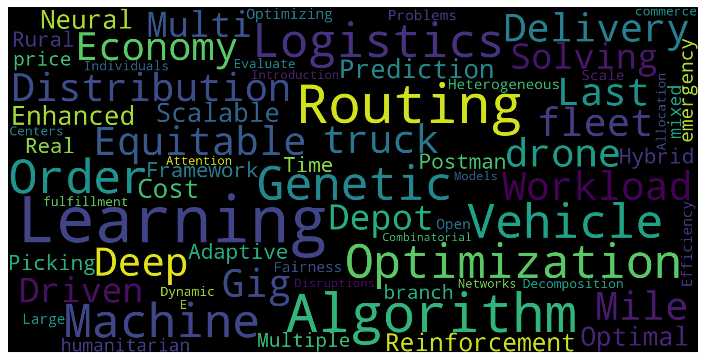
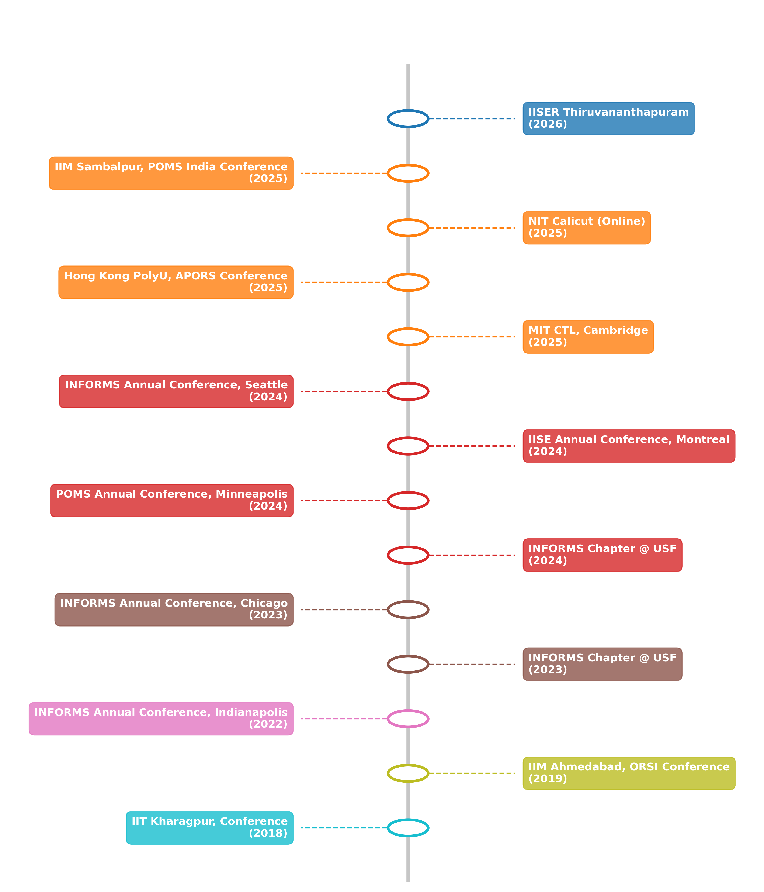

  
  

    
    
Key Research Themes

  

  

  

    
    
Timeline & Venue of Talks

  

<!-- 

# Conference Presentations

<ol reversed>

<li> INFORMS Annual Conference, Seattle, U.S.A. during October 20-23, 2024.
  
  Title: <em>Towards Equitable Workload Distribution in Last-Mile Delivery for the Gig Economy: The Dispatch Zone-Wave Problem</em> 
</li>

<li> IISE Annual Conference & Expo 2024, Montreal, Canada during May 18 - 21, 2024.
  
  Title: <em>A branch-and-price algorithm for emergency humanitarian logistics with a mixed truck-drone fleet</em> 
</li>

<li> 34th Annual POMS Conference, Minneapolis, U.S.A. during April 25 - 29, 2024.
  
  Title: <em>Optimizing Fairness and Efficiency in Heterogeneous Fleet Open Vehicle Routing Problem</em> 
</li>

<li> INFORMS Transportation and Logistics Society Triennial Conference, Chicago, U.S.A. during July 23 – 26, 2023.
  
  Title: <em>Solving Large-Scale Multi-Depot Vehicle Routing Problems via Decomposition and Deep Learning</em> 
</li>

<li> INFORMS Annual Conference, Indianapolis, U.S.A. during October 16-19, 2022.
  
  Title: <em>Solving the Multi-Depot Vehicle Routing Problem by a Genetic Algorithm with Learning to Evaluate Individuals</em>
</li>

<li> Operational Research Society of India Annual Conference held at IIM Ahmedabad, India during December 15-18, 2019.
  
  Title: <em>Dynamic Allocation of E-commerce Orders to Order-fulfillment Centers under Disruptions</em>
</li>

<li> International Conference on Applied and Computational Mathematics 2018 held at IIT Kharagpur, India during November 23-25, 2018.
  
  Title: <em>Integrated TOPSIS-AHP MCDM using possibility mean and variance in type-2 fuzzy environment</em>
</li>
</ol>

# Invited Talks

<ol reversed>
<li> MIT Center for Transportation &amp; Logistics, Cambridge, Massachusetts, U.S.A. on April 08, 2025.
  
  Title: <em>Towards Equitable Workload Distribution in Last-Mile Delivery for the Gig Economy </em> 
</li>

<li> Data Science Bootcamp 2024 by INFORMS Student Chapter at the University of South Florida on April 19, 2024.
  
  Topic: <em>Introduction to Machine Learning Models</em> 
</li>

<li> Presentation for INFORMS Student Chapter at the University of South Florida during Fall 2023.

Topic: <em>Attention Networks for Combinatorial Optimization</em>
    
</li>
</ol> -->