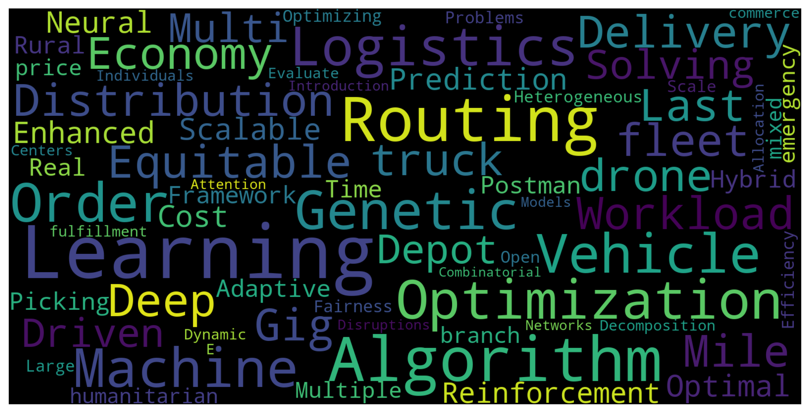
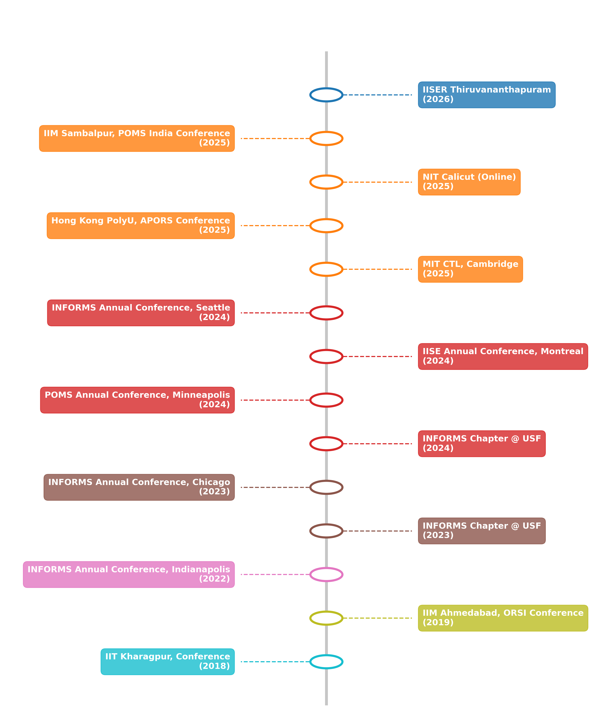

<!-- 

  
  

    
    
Key Research Themes

  

  

  

    
    
Timeline & Venue of Talks

  

 -->

Here is a list of my conference presentations, invited talks, and tutorials.

## 🎤 Invited Talks

**Powering Automated Warehouses: Dynamic Routing and Cooperative Charging for Order-Picking Devices** 
<i class="fas fa-university" style="color:#555;"></i> *University of Antwerp, Belgium* &nbsp;|&nbsp; <i class="far fa-calendar-alt" style="color:#555;"></i> *April 22, 2026*

**Machine Learning-Driven Logistics Optimization** 
<i class="fas fa-university" style="color:#555;"></i> *Frontiers Symposium in Data Science 2026, IISER Thiruvananthapuram, India* &nbsp;|&nbsp; <i class="far fa-calendar-alt" style="color:#555;"></i> *January 31, 2026*

**Towards Equitable Workload Distribution in Last-Mile Delivery for the Gig Economy** 
<i class="fas fa-university" style="color:#555;"></i> *MIT Center for Transportation & Logistics, Cambridge, Massachusetts, U.S.A.* &nbsp;|&nbsp; <i class="far fa-calendar-alt" style="color:#555;"></i> *April 08, 2025*

 

## 🏫 Tutorial Talks

**Machine Learning-Driven Logistics Optimization** 
<i class="fas fa-chalkboard-teacher" style="color:#555;"></i> *NIT Calicut, India (Online Short-Term Training Program)* &nbsp;|&nbsp; <i class="far fa-calendar-alt" style="color:#555;"></i> *December 19, 2025*

**Introduction to Machine Learning Models** 
<i class="fas fa-chalkboard-teacher" style="color:#555;"></i> *Data Science Bootcamp 2024, INFORMS Student Chapter at University of South Florida* &nbsp;|&nbsp; <i class="far fa-calendar-alt" style="color:#555;"></i> *April 19, 2024*

**Attention Networks for Combinatorial Optimization** 
<i class="fas fa-chalkboard-teacher" style="color:#555;"></i> *INFORMS Student Chapter at University of South Florida* &nbsp;|&nbsp; <i class="far fa-calendar-alt" style="color:#555;"></i> *Fall 2023*

 

## 🌍 Conference Presentations

**Towards Scalable and Optimal Routing: A Genetic Algorithm Enhanced with Neural Cost Prediction** 
<i class="fas fa-users" style="color:#555;"></i> *POMS India International Conference, IIM Sambalpur, India* &nbsp;|&nbsp; <i class="far fa-calendar-alt" style="color:#555;"></i> *December 13-16, 2025*

**A Deep Reinforcement Learning Framework for Adaptive Real-Time Order Picking** 
<i class="fas fa-users" style="color:#555;"></i> *POMS India International Conference, IIM Sambalpur, India* &nbsp;|&nbsp; <i class="far fa-calendar-alt" style="color:#555;"></i> *December 13-16, 2025*

**A Hybrid Genetic Algorithm for the Rural Postman Problem with Multiple Trucks and Drones** 
<i class="fas fa-users" style="color:#555;"></i> *Association of Asia-Pacific Operational Research Societies Youth Forum 2025, The Hong Kong Polytechnic University* &nbsp;|&nbsp; <i class="far fa-calendar-alt" style="color:#555;"></i> *November 29, 2025*

**Towards Equitable Workload Distribution in Last-Mile Delivery for the Gig Economy: The Dispatch Zone-Wave Problem** 
<i class="fas fa-users" style="color:#555;"></i> *INFORMS Annual Conference, Seattle, U.S.A.* &nbsp;|&nbsp; <i class="far fa-calendar-alt" style="color:#555;"></i> *October 20-23, 2024*

**A branch-and-price algorithm for emergency humanitarian logistics with a mixed truck-drone fleet** 
<i class="fas fa-users" style="color:#555;"></i> *IISE Annual Conference & Expo 2024, Montreal, Canada* &nbsp;|&nbsp; <i class="far fa-calendar-alt" style="color:#555;"></i> *May 18 - 21, 2024*

**Optimizing Fairness and Efficiency in Heterogeneous Fleet Open Vehicle Routing Problem** 
<i class="fas fa-users" style="color:#555;"></i> *34th Annual POMS Conference, Minneapolis, U.S.A.* &nbsp;|&nbsp; <i class="far fa-calendar-alt" style="color:#555;"></i> *April 25 - 29, 2024*

**Solving Large-Scale Multi-Depot Vehicle Routing Problems via Decomposition and Deep Learning** 
<i class="fas fa-users" style="color:#555;"></i> *INFORMS Transportation and Logistics Society Triennial Conference, Chicago, U.S.A.* &nbsp;|&nbsp; <i class="far fa-calendar-alt" style="color:#555;"></i> *July 23 – 26, 2023*

**Solving the Multi-Depot Vehicle Routing Problem by a Genetic Algorithm with Learning to Evaluate Individuals** 
<i class="fas fa-users" style="color:#555;"></i> *INFORMS Annual Conference, Indianapolis, U.S.A.* &nbsp;|&nbsp; <i class="far fa-calendar-alt" style="color:#555;"></i> *October 16-19, 2022*

**Dynamic Allocation of E-commerce Orders to Order-fulfillment Centers under Disruptions** 
<i class="fas fa-users" style="color:#555;"></i> *Operational Research Society of India Annual Conference, IIM Ahmedabad, India* &nbsp;|&nbsp; <i class="far fa-calendar-alt" style="color:#555;"></i> *December 15-18, 2019*

**Integrated TOPSIS-AHP MCDM using possibility mean and variance in type-2 fuzzy environment** 
<i class="fas fa-users" style="color:#555;"></i> *International Conference on Applied and Computational Mathematics 2018, IIT Kharagpur, India* &nbsp;|&nbsp; <i class="far fa-calendar-alt" style="color:#555;"></i> *November 23-25, 2018*